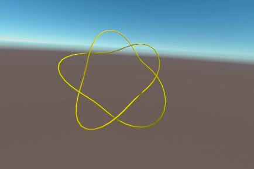

# Section
## Subsection
### Subsubsection
#### Subsubsubsection
[link test](https://google.com)

# 日本語で
## 書いても大丈夫？
### あいうえお
#### かきくけこ

[lorem-ipsum.pdf](resources/lorem-ipsum.pdf)

## 動画埋め込み
### ``
これはダメっぽい．

### `[pull knot](resources/pull.mp4)`
`!` を除いたので，ただのリンク．
リンクを開けば(ブラウザのデフォルト設定だと？)再生される．

[pull knot](resources/pull.mp4)

### htmlタグ
ページ内で再生できる．

<video src="resources/pull.mp4" width="320" controls />
